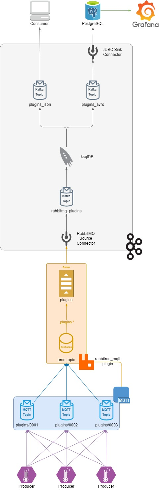

# comm-infra

PoC de infraestrutura de comunicação utilizando RabbitMQ e Kafka.

<p align="center">
  
</p>

## Pré-requisitos

- [Git](https://git-scm.com/)
- [Visual Studio Code](https://code.visualstudio.com/)
- [Docker](https://www.docker.com/)
  - [Docker Compose](https://docs.docker.com/compose/install/)
- [Go](https://go.dev/)

## Instruções

### Criando fila de mensagens no RabbitMQ

1. Acesse a UI do RabbitMQ Management: http://localhost:15672/

    - As credenciais de login são `guest`, para o usuário e a senha

2. Crie uma nova fila, através do menu **Queues**, com o nome `plugins` e configurações padrão

3. Adicione um *binding* desta fila à *exchange* `amq.topic`, utilizando como *routing key* o valor
   `plugins.*`

### Executando o *producer* MQTT

1. Execute o *producer* MQTT com o comando:

    ```bash
    go run producer/producer.go
    ```

    A partir deste momento, os eventos publicados pelo *producer* deverão constar na fila `plugins`
    do RabbitMQ, criada na etapa anterior.

### Integrando o RabbitMQ ao Kafka

1. Acesse o Confluent Control Center: http://localhost:9021/

2. Crie um novo tópico de nome `rabbitmq_plugins`, com configurações padrão

3. Crie um novo *connector* para extrair os eventos da fila `plugins`, do RabbitMQ, para o tópico
   `rabbitmq_plugins`, do Kafka:

    ```jsonc
    // .docker/kafka-connect/connectors/rabbitmq_plugins.properties
    {
      "name": "rabbitmq_plugins",
      "connector.class": "io.confluent.connect.rabbitmq.RabbitMQSourceConnector",
      "value.converter": "org.apache.kafka.connect.converters.ByteArrayConverter",
      "rabbitmq.host": "rabbitmq",
      "rabbitmq.username": "guest",
      "rabbitmq.password": "guest",
      "confluent.topic.bootstrap.servers": [
        "kafka:9092"
      ],
      "kafka.topic": "plugins",
      "rabbitmq.queue": [
        "plugins"
      ]
    }
    ```

    A partir deste momento, os eventos publicados pelo agente deverão constar no tópico
    `rabbitmq_plugins` do Kafka.

### Utilizando o ksqlDB para formatar os eventos

1. Acesse o container `comm-infra-ksqldb` e execute a CLI do ksqlDB:

    ```bash
    docker exec -it comm-infra-ksqldb sh
    ksql
    ```

2. Crie um *stream* `plugins_csv` para o tópico `rabbitmq_plugins`, interpretando-o no formato CSV:

    ```sql
    SET 'auto.offset.reset' = 'earliest';

    CREATE STREAM plugins_csv (
      client_id VARCHAR,
      code VARCHAR,
      value BIGINT,
      timestamp BIGINT
    ) WITH (KAFKA_TOPIC = 'rabbitmq_plugins', VALUE_FORMAT = 'DELIMITED');
    ```

3. Crie o tópico `plugins_json` a partir do *stream* `plugins_csv`, desta vez no formato JSON:

    ```sql
    CREATE STREAM plugins_json WITH (KAFKA_TOPIC = 'plugins_json', VALUE_FORMAT = 'JSON') AS
    SELECT
      csv.client_id AS "client_id",
      csv.code AS "code",
      csv.value AS "value",
      FORMAT_TIMESTAMP(
        FROM_UNIXTIME(csv.timestamp),
        'yyyy-MM-dd''T''HH:mm:ss.SSSX'
      ) AS "created_at"
    FROM
      plugins_csv csv EMIT CHANGES;

4. Crie o tópico `plugins_avro` a partir do *stream* `plugins_csv`, desta vez no formato Avro:

    ```sql
    CREATE STREAM plugins_avro WITH (KAFKA_TOPIC = 'plugins_avro', VALUE_FORMAT = 'AVRO') AS
    SELECT
      csv.client_id AS "client_id",
      csv.code AS "code",
      csv.value AS "value",
      FROM_UNIXTIME(csv.timestamp) AS "created_at"
    FROM
      plugins_csv csv EMIT CHANGES;
    ```

    O tópico `plugins_avro` é necessário, pois o conversor de JSON do Kafka Connect não é capaz de
    inferir o schema dos eventos no formato JSON. Além disso, o Avro suporta tipos virtuais, como o
    timestamp, que seria tratado como uma string no formato JSON.

### Integrando o banco de dados Postgres ao Kafka

1. Crie um novo *connector* para extrair os eventos do tópico `plugins_avro` e inseri-los no banco de dados Postgres:

    ```jsonc
    // .docker/kafka-connect/connectors/jdbc_plugins_avro.properties
    {
      "name": "jdbc_plugins_avro",
      "connector.class": "io.confluent.connect.jdbc.JdbcSinkConnector",
      "value.converter": "io.confluent.connect.avro.AvroConverter",
      "value.converter.schema.registry.url": "http://schema-registry:8081/",
      "topics": [
        "plugins_avro"
      ],
      "connection.url": "jdbc:postgresql://postgres:5432/comm_infra",
      "connection.user": "postgres",
      "connection.password": "postgres",
      "dialect.name": "PostgreSqlDatabaseDialect",
      "auto.create": "true"
    }
    ```

    A partir deste momento, os eventos publicados pelo agente deverão ser automaticamente inseridos no banco de dados.

### Criando dashboard de monitoramento com o Grafana

1. Acesse a URL do Grafana: http://localhost:3000

    - As credenciais padrão são `admin`, para o usuário e a senha

2. Em **Configuration** >> **Data sources**, adicione o banco de dados Postgres como a fonte padrão de dados

    - No campo *Host*, utilize a URL: `postgres:5432`

3. Crie um novo *dashboard* e, em um novo *painel*, utilize a query abaixo para criar um gráfico de série temporal:

    ```sql
    SELECT
      created_at AS "time",
      code AS metric,
      value
    FROM plugins_avro
    WHERE
      $__timeFilter(created_at) AND
      code IN ('0001', '0002')
    ORDER BY 1,2
    ```

### Consumindo eventos do tópico `plugins_json`

No momento, a biblioteca do *client* Kafka do Go não suporta a execução no Windows, sendo
necessário executar o comando abaixo de dentro do WSL, ou de um container do Docker.

Além disso, pode ser necessária a adição da linha abaixo ao arquivo `/etc/hosts`:

```
127.0.0.1   kafka
```

1. Execute o *consumer* do Kafka com o comando:

    ```bash
    go run consumer/consumer.go -t plugins_json -g consumer-group-1
    ```

## Versionamento

- **1.0.0:** Versão inicial

## Tecnologias utilizadas

Consulte a documentação das tecnologias abaixo para obter proficiência no desenvolvimento e
manutenção deste projeto:

- [MQTT](https://mqtt.org/)
- [RabbitMQ](https://www.rabbitmq.com/)
- [Kafka](https://kafka.apache.org/)
- [Grafana](https://grafana.com/)
- [PostgreSQL](https://www.postgresql.org/)
